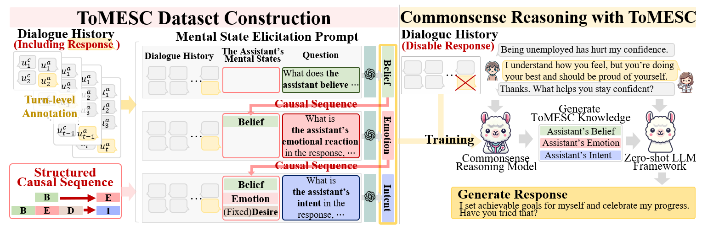

# ToMESC

## License

This dataset is derived from the [ESConv dataset](https://github.com/thu-coai/Emotional-Support-Conversation).  
  
The original ESConv dataset is licensed under the  
**Creative Commons Attribution-NonCommercial 4.0 International (CC BY-NC 4.0)** license.  
> © 2021 CoAI Group, Tsinghua University. All rights reserved.  
> Data and code are for academic research use only.

Accordingly, the ToMESC dataset is distributed under the same license and terms:  
**For academic research use only. Commercial use is strictly prohibited.**

For more information, see `LICENSE-ESConv`.  
All derived material in this repository is subject to the same non-commercial restriction.

### Ethical Considerations

ToMESC contains no personally identifiable information (PII).  
All user utterances are retained as-is from ESConv, and assistant mental state annotations are automatically generated using GPT-4o with prompts grounded in psychological research. 
A portion of the annotations was manually reviewed to ensure quality and alignment with ethical standards, as detailed in **Evaluate the ToMESC quality**.

Given the sensitive nature of ESC, we emphasize that this dataset is intended strictly for academic research.  
We discourage any use in real-world clinical, therapeutic, or high-stakes applications without proper human oversight.

## Data

We introduce **ToMESC**, a Theory of Mind-based dataset that models an assistant’s latent mental states—**Belief**, **Emotion**, **Desire**, and **Intent**—in a structured causal sequence.  
The dataset is publicly available at [https://zenodo.org/doi/10.5281/zenodo.15624491](https://zenodo.org/doi/10.5281/zenodo.15624491).
Download ToMESC and place it in the `data/` folder before running any scripts.

---

## Dataset Construction

To construct the ToMESC dataset from ESConv, run the following after downloading ESConv:

  `python create_mental_state.py --api_key OPENAI_API_KEY --model_type gpt-4o-2024-11-20`

## Fine-tuning (SFT) using ToMESC

To fine-tune a model using the training split of ToMESC:

  `python Fine-Tuning.py --mental_state_type All --data_dir data --batch_size 4 -num_epochs 5 --learning_rate 3e-5 --lora_r 8 --lora_alpha 16 --lora_dropout 0.05`

## Evaluate the ToMESC quality

To assess the quality of ToMESC annotations, we conducted a human evaluation on 100 randomly sampled dialogues. Four annotators independently rated each assistant utterance across three mental state categories—**Belief**, **Emotion**, and **Intent**—using four evaluation criteria per category, each on a 1–3 scale. To measure inter-annotator reliability, we report Gwet’s AC1, which is robust against prevalence and marginal distribution biases. Across all categories and criteria, AC1 values ranged from 0.6 to 0.8, indicating substantial agreement among annotators.

The evaluation was performed using the following command:

 `python evaluate_human_sample.py --read_file ToMESC_sample.jsonl`

The detailed results are summarized below:

| Mental State | Evaluation Criteria | Score | Gwet’s AC1 |
|--------------|---------------------|-------|------------|
| Belief | (1) Consistency with dialogue history | 2.8898 | 0.7456 |
| Belief | (2) Appropriateness to the user’s mental state | 2.8152 | 0.7404 |
| Belief | (3) Depth beyond surface repetition | 2.8731 | 0.6816 |
| Belief | (4) Alignment with next-turn utterance | 2.8282 | 0.7521 |
| Emotion | (1) Appropriateness to emotional tone in the response | 2.8389 | 0.8004 |
| Emotion | (2) Agreement with affective style and tone | 2.8544 | 0.6570 |
| Emotion | (3) Validity of mixed emotions | 2.8425 | 0.7643 |
| Emotion | (4) Coherence between Belief and Emotion | 2.8476 | 0.6910 |
| Intent | (1) Match with strategy in response | 2.8665 | 0.6627 |
| Intent | (2) Predictability of utterance | 2.8675 | 0.6995 |
| Intent | (3) Causal grounding in user state | 2.8716 | 0.6689 |
| Intent | (4) Coherence between Emotion and Intent | 2.8944 | 0.6815 |

The evaluation criteria in the prompt file were carefully designed to reflect both the practical goals of emotional support and the theoretical foundations of mental state reasoning. Specifically, **Criteria 1 and 4 of Belief, Criterion 2 of Emotion, and Criterion 2 of Intent** are based on prior **ESC research**, ensuring alignment with therapeutic approaches in emotional support. In contrast, **Criteria 2 and 3 of Belief, Criterion 4 of Emotion, and Criteria 1, 3, and 4 of Intent** draw from **Theory of Mind (ToM) and psychological literature** to assess causal coherence in the assistant’s reasoning. **The remaining Emotion criteria** are grounded in **affective science**, including Plutchik’s psychoevolutionary theory of basic emotions and emotion evaluation benchmarks such as EmoBench. This blended design ensures a comprehensive and theoretically grounded evaluation of mental state quality in ToMESC.

## Inference

Run inference for each mental state:

  `python inference_mental_state.py --mental_state_type Belief --check_point BestCheckPoint --test_file data/test.jsonl`

  
  `python inference_mental_state.py --mental_state_type Emotion --check_point BestCheckPoint --test_file data/test.json`

  
  `python inference_mental_state.py --mental_state_type Intent --check_point BestCheckPoint --test_file data/test.json`

## Zero-shot Response Generation

To generate responses using a zero-shot LLM:

  `python generate_response.py --model_name meta-llama/Llama-2-7b-chat-hf --test_file Meta-Llama-3.1-8B-Instruct/model/Full_FT/All/output_BestCheckPoint.jsonl --output_file output/output_All_response_BestCheckPoint.jsonl --new_max_token 100`

## Evaluation

Evaluate Inferred Mental States

  `python evaluate_metrics.py --data_dir Meta-Llama-3.1-8B-Instruct/model/Full_FT/All --check_point BestCheckPoint`

Evaluate Generated Responses

  `python evaluate_metrics.py --data_dir Meta-Llama-3.1-8B-Instruct/model/Full_FT/All --check_point BestCheckPoint --is_response true`

Evaluate with G-Eval
After post-processing the response outputs, ensure your file (e.g., test_response_200.jsonl) follows this format:

  `{
    "data_idx": "DialogueIdx_TurnIdx",
    "response": {
      "baseline": "...",
      "all": "...",
      "dialect": "...",
      "comet": "...",
      "doctor": "...",
      "sibyl": "..."
    },
    "conversation": [ ... ]
  }`

Then run:

  `python g_eval.py --read_file test_response_200.jsonl --model_type gpt-4o-mini-2024-07-18 --api_key OPENAI_API_KEY`
