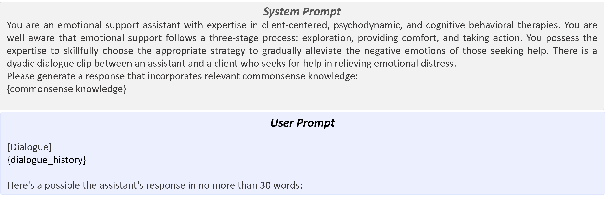

# A Mental State Extraction Dataset for Theory-of-Mind-based Reasoning in Emotional Support Conversations

## License

This dataset is derived from the [ESConv dataset](https://github.com/thu-coai/Emotional-Support-Conversation).  
  
The original ESConv dataset is licensed under the  
**Creative Commons Attribution-NonCommercial 4.0 International (CC BY-NC 4.0)** license.  
> © 2021 CoAI Group, Tsinghua University. All rights reserved.  
> Data and code are for academic research use only.

Accordingly, the MENTOS dataset is distributed under the same license and terms:  
**For academic research use only. Commercial use is strictly prohibited.**

For more information, see `LICENSE-ESConv`.  
All derived material in this repository is subject to the same non-commercial restriction.

## MENTOS Dataset


We introduce **MENTOS**, a dataset that provides turn-level annotations of the assistant’s mental states (**Belief**, **Emotion**, **Desire**, and **Intent**), organized in a causal structure reflecting psychological principles.
This design integrates psychological principles of Theory of Mind (ToM) into commonsense reasoning.
A commonsense reasoning model trained on MENTOS predicts these mental states as intermediate reasoning signals that guide response generation, and these mental states were then injected into LLM-based response generators in a zero-shot setting.

### Dataset Construction

To construct the MENTOS dataset from ESConv, run the following command after downloading the ESConv dataset:

  `python create_mental_state.py --api_key OPENAI_API_KEY --model_type gpt-4o-2024-11-20`

**Mental State Extraction Prompt Components**

For each target mental state, the MENTOS dataset is constructed using the following components within the mental state extraction prompt:

(1) Dialogue history,

(2) Assistant response, including the supportive strategy description (strategy_info in `create_mental_state.py`).

(3) Assistant Mental State Component

(4) Question Component (mental_state_question_dict  in `create_mental_state.py`)

(5) Constraint Component

<p align="center">  </p>

These components together guide the model in generating structured annotations for each mental state (Belief, Emotion, Intent).
Among these, the Constraint Component for Emotion employs basic and mixed emotion categories, along with an intensity scale (0: None, 1: Low, 2: Medium, 3: High), grounded in psychological research ([Plutchik, 1982](https://is.muni.cz/el/1421/jaro2011/PSA_033/um/plutchik.pdf); [Sabour et al., 2024](https://aclanthology.org/2024.acl-long.326.pdf))

<p align="center">
  
</p>
<p align="center"><em>Image source: <a href="https://aclanthology.org/2024.acl-long.326.pdf">EmoBench: Evaluating the Emotional Intelligence of Large Language Models</a> (Sabour et al., ACL 2024)</em></p>


The dataset is built based on a turn-level annotation schema.
Each dialogue contains multiple turns, and for every turn (t), an independent data sample is created.
Each data sample consists of:

(1) Dialogue history up to the t-th client utterance

(2) The assistant’s response at the t-th turn

(3) The corresponding three mental state annotations (Belief, Emotion, and Intent)

Thus, a single dialogue yields as many data samples as there are turns

An example **MENTOS dataset sample** for a 2-turn dialogue is shown below:

```
{
  "data_idx": "example_id",
  "mental_state": {
    "Belief": "The assistant believes the client is feeling frustrated and struggling with the limitations of staying indoors, despite being an introvert, and is seeking understanding or validation for their emotional experience.",
    "Emotion": "[Basic] Sadness (opposite Joy): 2, Disgust (opposite Trust): 0, Anger (opposite Fear): 0, Anticipation (opposite Surprise): 0, Joy (opposite Sadness): 0, Trust (opposite Disgust): 2, Fear (opposite Anger): 0, Surprise (opposite Anticipation): 0\n[Mixed] Hopelessness (sadness + fear): 0, Remorse (sadness + disgust): 0, Disappointment (sadness + surprise): 0, Sentimental (sadness + trust): 2, Jealousy (sadness + anger): 0, Pessimism (sadness + anticipation): 0, Embarrassment (disgust + fear): 0, Pride (anger + joy): 0, Nervousness (anticipation + fear): 0, Delight (joy + surprise): 0, Gratitude/Love/Caring (joy + trust): 0, Hope/Optimism (joy + anticipation): 0, Guilt (joy + fear): 0, Curiosity (surprise + trust): 0",
    "Intent": "The assistant’s intent is to validate the client’s feelings of frustration, foster a sense of shared experience, and provide emotional reassurance by expressing empathy and understanding of the challenges of being confined indoors."
  },
  "conversation": [
    {"text": "Hello. How are you?", "speaker": "seeker"},
    {"text": "I'm doing well. How are you?", "speaker": "supporter", "strategy": "Reflection of feelings", "all_strategy": ["Reflection of feelings"]},
    {"text": "I am having a difficult time not being able to go out. I am an introvert and didn't think COVID-19 would be a problem but I find myself being short and impatient.", "speaker": "seeker"}, 
    {"text": "Yeah I'm in the same boat. It's tough having to be cooped up.", "speaker": "supporter", "strategy": "Affirmation and Reassurance", "all_strategy": ["Affirmation and Reassurance"]} # The assistant’s response at the 2nd turn.
  ]
}
```

### Evaluate the MENTOS quality

To assess the quality of MENTOS annotations, we conducted a human evaluation on 100 randomly sampled dialogues. Four annotators independently rated each assistant utterance across three mental state types (**Belief**, **Emotion**, and **Intent**) using four evaluation criteria per category, each on a 1–3 scale. To measure inter-annotator reliability, we report Gwet’s AC1, which is robust against prevalence and marginal distribution biases. Across all categories and criteria, AC1 values ranged from 0.6 to 0.8, indicating substantial agreement among annotators.

The evaluation was performed using the following command:

 `python evaluate_human_sample.py --read_file MENTOS_sample.jsonl`

## MENTOS-trained Commonsense Reasoning Model

### Fine-tuning (SFT) using MENTOS

To fine-tune a model using the training split of MENTOS:

  `python Fine-Tuning.py --mental_state_type All --data_dir data --batch_size 4 -num_epochs 5 --learning_rate 3e-5 --lora_r 8 --lora_alpha 16 --lora_dropout 0.05`

For each target mental state, the MENTOS-trained model is fine-tuned using the following components within the prompt:

(1) Dialogue history

(2) Assistant Mental State Component

(3) Question Component

(4) Constraint Component

<p align="center">  </p>


### Inference

Run inference for each mental state:

  `python inference_mental_state.py --mental_state_type Belief --check_point BestCheckPoint --test_file data/test.jsonl`

  
  `python inference_mental_state.py --mental_state_type Emotion --check_point BestCheckPoint --test_file data/test.json`

  
  `python inference_mental_state.py --mental_state_type Intent --check_point BestCheckPoint --test_file data/test.json`

## Zero-shot Response Generation

To generate responses using a zero-shot LLM:

  `python generate_response.py --model_name meta-llama/Llama-2-7b-chat-hf --test_file Meta-Llama-3.1-8B-Instruct/model/Full_FT/All/output_BestCheckPoint.jsonl --output_file output/output_All_response_BestCheckPoint.jsonl --new_max_token 100`

For each target mental state, the response generator produces responses using the following components within the prompt:

(1) Dialogue history

(2) Commonsense Knowledge

<p align="center">  </p>

Following the input format of commonsense knowledge in [Sibyl: Empowering Empathetic Dialogue Generation in Large Language Models via Sensible and Visionary Commonsense Inference](https://aclanthology.org/2025.coling-main.10/) (Wang et al., COLING 2025), we also reconstructed the Emotion outputs from the MENTOS-trained model, along with those from other reasoning models, into full sentences to provide the response generator with clearer and more consistent knowledge information.
Accordingly, nonzero mixed emotions were also converted into single, sentence-level expressions aligned with the Belief and Intent formats. Scores of 1, 2, and 3 were replaced with "slight," "clear," and "strong," respectively, so an Emotion output could be represented as : \textit{In response to the client’s last utterance, the assistant expresses slight sentimentality, clear caring and hope.}


## Evaluate Generated Responses

### (1) Automatic Evaluation Metrics

To use automatic evaluation metrics,

  `python evaluate_metrics.py --data_dir Meta-Llama-3.1-8B-Instruct/model/Full_FT/All --check_point BestCheckPoint --is_response true`

### (2) G-Eval

After post-processing the response outputs, ensure your file (e.g., test_response_200.jsonl) follows this format:

  ```
{
    "data_idx": "DialogueIdx_TurnIdx",
    "response": {
      "baseline": "...",
      "all": "...",
      "dialect": "...",
      "comet": "...",
      "doctor": "...",
      "sibyl": "..."
    },
    "conversation": [ ... ]
  }
```

Then run:

  `python g_eval.py --read_file test_response_200.jsonl --api_key OPENAI_API_KEY  --model_type gpt-4o-mini-2024-07-18`

Using the following prompt:
<p align="center">  </p>

## Case Study
We demonstrate the effectiveness of the MENTOS-trained model through a representative ESC example, where the client expresses financial stress caused by COVID-19, a loss of self-confidence, and explicitly seeks experience-based encouragement from the assistant.

<p align="center">  </p>

In the w/o Knowledge setting, only the dialogue history is provided to , without any external commonsense knowledge.
As a result, the generated response fails to directly address the client’s request regarding the assistant’s personal experience.

When using COMET, which relies solely on the last client utterance, the model misclassifies the user’s state (“Thanks. I appreciate that”) and simplifies the complex emotion as merely happy, overlooking the broader context of emotional vulnerability.

When using DOCTOR, the inferred knowledge contains vague elements such as the term “project”, and emotional cues from the client are omitted during multi-hop reasoning.
The generated commonsense primarily focuses on the client (Spike) seeking help, while the xIntent type emphasizes networking rather than emotional support.
Consequently,  with DOCTOR fails to provide meaningful guidance for generating empathetic or problem-solving–oriented responses.

When using DIALeCT, the inferred knowledge (e.g., SubEv, Prere, Motiv) more accurately reflects the dialogue history.
However, in the final turn, the Cause type is reversed: instead of recognizing that the client asks the assistant for strategies to regain self-confidence, it incorrectly describes the assistant as the one asking.
This role inversion causes inconsistency between Cause and other knowledge types.

When using , the predicted Intent type is inconsistent with the inferred Cause, often expressing the opposite meaning. This appears to stem from Sibyl’s independent generation process, where each knowledge type is modeled separately without causal dependency.

In contrast, the proposed  extracts the assistant’s mental states across multi-turn dialogues in a causally coherent manner. Each mental state (Belief, Emotion, Intent) is generated with sequential dependency, as reflected in the color-coded links in the table, resulting in more consistent state interpretations and contextually appropriate responses.
Furthermore, G-Eval results support this finding, showing that responses generated with  are more supportive than those from other models.
